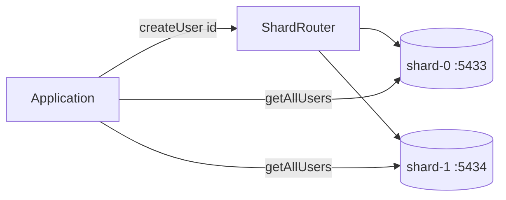

# JV

Java 23 + Gradle monorepo for independently runnable projects.

## Projects

- `plain-java-app` — standalone Java application
- `spring-service` — Spring Boot web application
- `system-design-arpit-bh` — system design exercises (plain Java): connection pool, bounded blocking queue, and a **database sharding prototype** (see below)

## Commands

```bash
./gradlew :plain-java-app:run
./gradlew :system-design-arpit-bh:run
./gradlew :spring-service:bootRun
./gradlew test
./gradlew build
```

## First-time setup

Install a Java 23 JDK and Gradle 8.14.3 or newer, then generate the committed
Gradle Wrapper:

```bash
gradle wrapper --gradle-version 8.14.3
```

After that, use `./gradlew` for all project commands.

Add new projects under `projects/`, then include them in `settings.gradle`.

---

## Database sharding prototype

Location: `projects/system-design-arpit-bh/src/main/java/com/nabajyoti/systemdesign/week1/db/sharding/prototype/`

A hands-on **two-shard PostgreSQL** setup that shows how application code can route writes by user ID and fan out reads across shards.

### What it demonstrates

| Concern | Approach in this prototype |
|--------|----------------------------|
| **Sharding** | Two independent Postgres instances (`shard-0`, `shard-1`) |
| **Routing** | `ShardRouter` maps `userId % 2` → `SHARD_0` or `SHARD_1` |
| **Writes** | `UserService.createUser` picks the shard, then `UserRepository.save` inserts on that JDBC connection only |
| **Scatter–gather reads** | `UserService.getAllUsers` queries every shard in parallel (`CompletableFuture.supplyAsync`) and merges results |
| **Point lookups** | `UserRepository.findById` runs on the shard you route to (same pattern as writes) |



### Components

- **`Shard` / `ShardRouter`** — shard metadata and modulo-based routing key
- **`DatabaseConnectionManager`** — JDBC connections per shard (PostgreSQL driver)
- **`UserRepository`** — SQL for insert, list-by-shard, and find-by-id
- **`UserService`** — orchestration: route on create; parallel scatter–gather for list-all
- **`docker-compose.yml`** — Postgres 17 on host ports **5433** and **5434**

Demo entry point: `com.nabajyoti.systemdesign.week1.db.sharding.prototype.Main` (creates sample users routed to different shards).

### Run locally

**1. Start the shard databases**

```bash
docker compose -f projects/system-design-arpit-bh/src/main/java/com/nabajyoti/systemdesign/week1/db/sharding/prototype/docker-compose.yml up -d
```

**2. Create the `users` table on both shards** (same schema on each):

```bash
for port in 5433 5434; do
  PGPASSWORD=shard_password psql -h localhost -p "$port" -U shard_user -d shard_db -c "
    CREATE TABLE IF NOT EXISTS users (
      id BIGINT PRIMARY KEY,
      name VARCHAR(255) NOT NULL,
      email VARCHAR(255) NOT NULL
    );"
done
```

**3. Run the demo**

The Gradle `application` plugin defaults to `com.nabajyoti.systemdesign.Main`. Run the sharding demo by setting the main class in your IDE, or temporarily in `projects/system-design-arpit-bh/build.gradle`:

```gradle
application {
    mainClass = 'com.nabajyoti.systemdesign.week1.db.sharding.prototype.Main'
}
```

Then:

```bash
./gradlew :system-design-arpit-bh:run
```

You should see log lines showing each user ID routed to `SHARD_0` or `SHARD_1`. User `101` → shard 1, user `102` → shard 0 (`userId % 2`).

**Stop containers**

```bash
docker compose -f projects/system-design-arpit-bh/src/main/java/com/nabajyoti/systemdesign/week1/db/sharding/prototype/docker-compose.yml down
```
