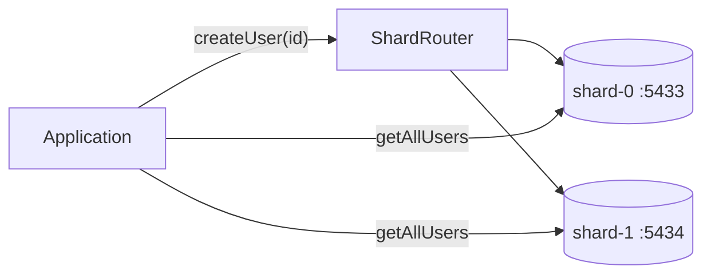

# PostgreSQL Sharding Prototype

## What this is

A hands-on two-shard PostgreSQL prototype showing how application code can
route writes by user ID and fan out reads across shards.

## Architecture

| Concern | Approach |
|---|---|
| Sharding | Two independent PostgreSQL instances: `shard-0` and `shard-1` |
| Routing | `ShardRouter` maps `userId % 2` to `SHARD_0` or `SHARD_1` |
| Writes | `UserService.createUser` selects a shard, then `UserRepository.save` inserts through that shard's JDBC connection |
| Scatter-gather reads | `UserService.getAllUsers` queries every shard in parallel with `CompletableFuture` and merges the results |
| Point lookups | `UserRepository.findById` queries the shard selected for the user ID |



## Components

- `Shard` and `ShardRouter` — shard metadata and modulo-based routing.
- `DatabaseConnectionManager` — opens JDBC connections for each shard.
- `UserRepository` — SQL for inserts, per-shard list queries, and point lookups.
- `UserService` — routes writes and coordinates parallel scatter-gather reads.
- `docker-compose.yml` — runs PostgreSQL 17 on host ports `5433` and `5434`.
- `Main` — demo entry point that creates sample users on different shards.

## Run locally

### 1. Start the shard databases

From the repository root:

```bash
docker compose \
  -f projects/system-design-arpit-bh/src/main/java/com/nabajyoti/systemdesign/week1/db/sharding/prototype/docker-compose.yml \
  up -d
```

### 2. Create the `users` table on both shards

```bash
for port in 5433 5434; do
  PGPASSWORD=shard_password psql -h localhost -p "$port" \
    -U shard_user -d shard_db -c "
      CREATE TABLE IF NOT EXISTS users (
        id BIGINT PRIMARY KEY,
        name VARCHAR(255) NOT NULL,
        email VARCHAR(255) NOT NULL
      );"
done
```

### 3. Run the demo

The Gradle `application` plugin defaults to another main class. Set the
sharding demo as the main class in your IDE, or temporarily in
`projects/system-design-arpit-bh/build.gradle`:

```gradle
application {
    mainClass = 'com.nabajyoti.systemdesign.week1.db.sharding.prototype.Main'
}
```

Then run:

```bash
./gradlew :system-design-arpit-bh:run
```

The demo logs which shard receives each user. For example, user `101` routes
to `SHARD_1` and user `102` routes to `SHARD_0` because routing uses
`userId % 2`.

### 4. Stop the databases

```bash
docker compose \
  -f projects/system-design-arpit-bh/src/main/java/com/nabajyoti/systemdesign/week1/db/sharding/prototype/docker-compose.yml \
  down
```
